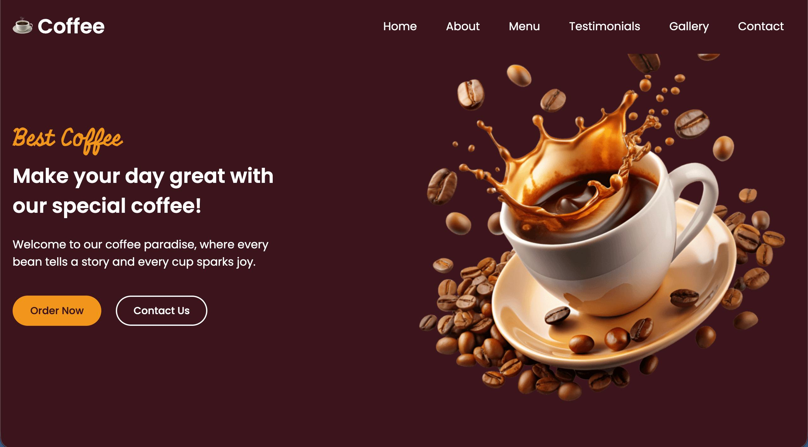
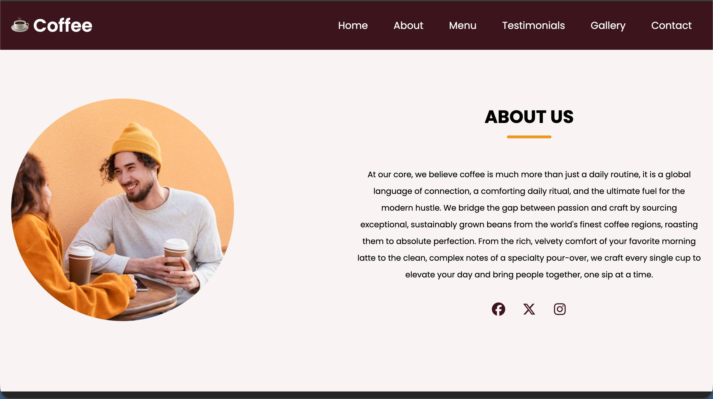
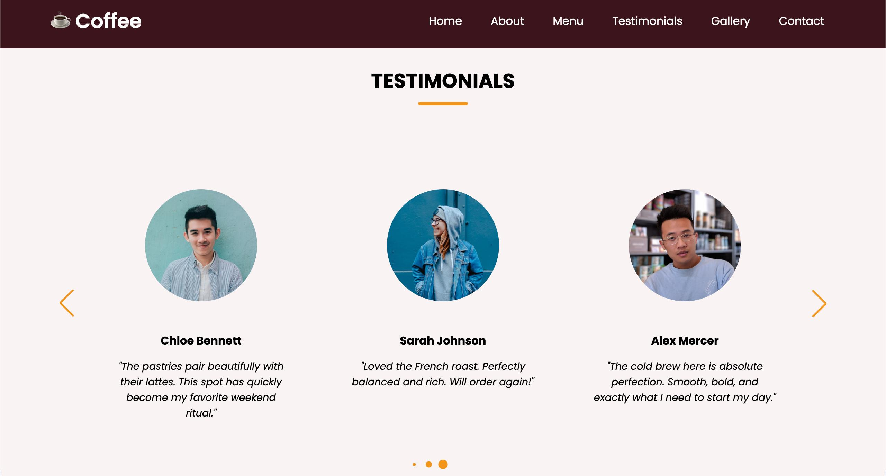

# Coffee Website Landing Page

A modern and responsive coffee shop landing page built using HTML, CSS, and JavaScript as part of the Oasis Infobyte Web Development and Designing Internship.

## Project Links

**✨ See it in action:** Check out the [Live Demo](https://varuntg156.github.io/coffee-shop/) to explore the full landing page experience instantly!

## Features

- Responsive landing page design
- Modern and clean user interface
- Navigation bar
- Hero section
- Menu section
- About section
- Testimonials section
- Gallery section
- Contact section
- Mobile-friendly layout

## Technologies Used

- HTML5
- CSS3
- JavaScript

## Project Structure

```text
VARUN_T_G_Task1_Landing_Page/
├── Screenshots/
├── images/
├── index.html
├── style.css
├── legal-style.css
├── script.js
├── privacy.html
└── refund.html
```

## Screenshots








## Getting Started

1. Clone the repository:

```bash
git clone https://github.com/varuntg156/OIBSIP.git
```

2. Navigate to the project folder:

```text
VARUN_T_G_Task1_Landing_Page
```

3. Open `index.html` in any modern web browser.

---

**Internship:** Oasis Infobyte Web Development and Designing Internship  
**Task:** Task 1 – Landing Page